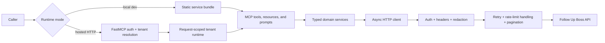

# Architecture

## Design Goals

The repository is structured so that:

- Follow Up Boss API behavior lives in typed Python modules rather than in MCP tool handlers.
- hosted `streamable-http` requests authenticate and resolve to exactly one tenant before any
  upstream client is created.
- hosted tenant runtimes are request-scoped so tenants do not share Follow Up Boss clients or
  secret material.
- transport concerns are centralized and testable in isolation.
- MCP tools, resources, and prompts stay narrow, predictable, and JSON-serializable.
- webhook verification and eventual-consistency handling are reusable outside MCP.

## Module Layout

### Core configuration and hosted boundary

- `src/followupboss_mcp/config.py`: split server bootstrap settings from tenant runtime settings,
  plus a backward-compatible local wrapper.
- `src/followupboss_mcp/hosted_auth.py`: canonical hosted bearer-token identity models, FastMCP
  token verifier, and auth-context helpers.
- `src/followupboss_mcp/tenant_store.py`: tenant and credential resolution abstraction plus
  development-backed implementations.
- `src/followupboss_mcp/tenant_runtime.py`: request-scoped tenant runtime model and service-bundle
  factory.
- `src/followupboss_mcp/hosted_rate_limits.py`: hosted endpoint abuse controls keyed by tenant and
  client.
- `src/followupboss_mcp/constants.py`: protocol and package constants.
- `src/followupboss_mcp/auth.py`: outbound Basic and Bearer auth strategies for Follow Up Boss.
- `src/followupboss_mcp/logging.py`: logger configuration, sensitive-header redaction, and audit
  emission helpers.
- `src/followupboss_mcp/retry.py`: truncated exponential backoff with jitter.
- `src/followupboss_mcp/rate_limits.py`: `Retry-After` parsing for upstream Follow Up Boss
  responses.
- `src/followupboss_mcp/pagination.py`: normalized pagination metadata and async pagination
  helpers.
- `src/followupboss_mcp/http_client.py`: centralized async HTTP transport and error mapping.

### Domain models and services

- `src/followupboss_mcp/models/common.py`: shared query, request, response, and JSON value types.
- `src/followupboss_mcp/models/*.py`: domain-specific request and response models.
- `src/followupboss_mcp/services/*.py`: typed service methods for each supported Follow Up Boss
  domain.

### MCP and webhook layer

- `src/followupboss_mcp/webhooks.py`: signature verification, parsed webhook notification helpers,
  fast-ack helpers.
- `src/followupboss_mcp/mcp_tools.py`: MCP-safe adapter over typed services.
- `src/followupboss_mcp/mcp_registration.py`: grouped FastMCP registration helpers for tools, the
  resource, and the prompt, plus hosted runtime resolution for non-tool surfaces.
- `src/followupboss_mcp/mcp_server.py`: FastMCP construction, hosted auth and rate-limit wiring,
  and local versus request-scoped service-bundle assembly.
- `src/followupboss_mcp/cli.py`: `stdio` and local `streamable-http` entrypoint.

## Runtime Modes

| Mode | Transport | Auth boundary | Client lifecycle |
| --- | --- | --- | --- |
| Local single-tenant | `stdio` or `streamable-http` | outbound Follow Up Boss auth only | one startup-time `FollowUpBossAsyncClient` and static service bundle |
| Hosted multi-tenant | `streamable-http` only | inbound bearer-token auth plus outbound tenant credential auth | one request-scoped `FollowUpBossAsyncClient` and service bundle per MCP call |

This split keeps the local CLI simple while giving hosted deployments a safer tenant boundary.

## Runtime Config Split

The runtime configuration is separated intentionally:

- `FollowUpBossServerSettings` owns server-only bootstrap fields such as transport, host, port,
  mount path, and log level.
- `HostedAuthSettings` owns the FastMCP resource-server settings for hosted bearer-token auth:
  `issuer_url`, `resource_server_url`, and optional `required_scopes`.
- `FollowUpBossTenantRuntimeDefaults` owns the shared non-secret Follow Up Boss HTTP-client
  defaults used by hosted deployments: `base_url`, `timeout_seconds`, and `max_retries`.
- `FollowUpBossTenantSettings` owns one tenant's Follow Up Boss credentials and inherits those
  HTTP-client defaults for the actual upstream client.
- `FollowUpBossSettings` remains as a backward-compatible composite model for current local
  development and tests.

That split keeps local inspection working while removing the assumption that one process-wide
environment-backed credential object should also own hosted server bootstrap forever. When hosted
auth is enabled and no explicit defaults object is passed, `create_server()` falls back to the
built-in `base_url`/timeout/retry constants instead of reading tenant credential environment
variables.

For the first hosted release, `base_url`, `timeout_seconds`, and `max_retries` remain shared
defaults that the hosted runtime factory copies into each request-scoped tenant settings object.
Credential material itself is always loaded from `TenantStore` in hosted mode.

## Hosted Auth Contract

Hosted `streamable-http` uses FastMCP's `auth` and `token_verifier` hooks.
`HostedIdentityVerifier` verifies the raw bearer token into `HostedVerifiedIdentity`, which carries:

- required `tenant_id`
- required `subject`
- required `client_id`
- optional `scopes`
- optional `expires_at`
- optional `token_id`
- optional `credential_id`

`HostedTenantTokenVerifier` then resolves `tenant_id` through `TenantStore`, checks optional
`credential_id` binding, emits audit events, and stores a `HostedAccessToken` in the FastMCP auth
context.

All registered hosted MCP surfaces share the same auth boundary. Tools, the
`followupboss://api-coverage-matrix` resource, and the `followupboss_compose_lead_event` prompt all
require the authenticated tenant context. There are no intentionally public hosted resources or
prompts in the current design.

## Runtime Layering

## Hosted Request Lifecycle

1. A hosted caller sends a bearer token to the `streamable-http` endpoint.
2. FastMCP auth middleware calls `HostedTenantTokenVerifier`.
3. The verifier delegates raw token validation to the deployment-specific `HostedIdentityVerifier`.
4. The verifier resolves the active tenant and credential from `TenantStore` and stores a
   `HostedAccessToken` in auth context.
5. A tool, resource, or prompt handler asks `TenantRuntimeFactory` for the current tenant runtime.
6. `TenantRuntimeFactory` re-resolves the tenant from `TenantStore` for the active call, checks
   that the credential binding still matches, and projects the stored credential into
   `FollowUpBossTenantSettings`.
7. The runtime factory creates a fresh `FollowUpBossAsyncClient`, builds the typed service bundle,
   and closes the client after the handler returns.
8. The MCP handler delegates to the service layer and returns a JSON-safe response.

If tenant or credential state changes after initial auth but before runtime creation, the call
still fails closed with `Hosted tenant runtime is unavailable.` rather than using stale credential
material.

## Local Request Lifecycle

1. The CLI loads `FollowUpBossSettings` from environment variables.
2. `create_server()` builds one shared `FollowUpBossAsyncClient` and one static service bundle.
3. `stdio` or local `streamable-http` calls use that shared bundle without hosted auth or tenant
   re-resolution.

This keeps local inspection simple and backward-compatible while clearly separating it from the
hosted product path.

## Hosted Endpoint Rate Limiting

When hosted auth is enabled, `FollowUpBossFastMCP.streamable_http_app()` wraps the configured MCP
route with `HostedRateLimitMiddleware`. That limiter is partitioned by `tenant_id` and `client_id`,
with an optional IP dimension left disabled by default until proxy trust is defined.

This sits at the hosted edge and is intentionally separate from the upstream Follow Up Boss `429`
retry logic in the HTTP client.

## Retry Strategy

The transport layer implements the retry rules centrally:

- `429` responses respect `Retry-After` when present.
- retryable `5xx` statuses use truncated exponential backoff with jitter.
- transport-level `httpx` failures share the same retry policy.
- retries stop after `FOLLOWUPBOSS_MAX_RETRIES`.
- retry state is never embedded in MCP tool handlers.

This keeps Follow Up Boss behavior consistent whether the caller is MCP, a script, or direct Python
code.

## Pagination Strategy

Follow Up Boss documents both `next` token pagination and `offset` plus `limit`. The repository
models both:

- `parse_pagination_metadata()` normalizes `_metadata` into a single `PaginationMetadata`
  structure.
- `AsyncPaginator` prefers `next` when it exists.
- when `next` is absent but `total` still indicates more data, pagination falls back to `offset`.
- raw metadata is preserved for MCP callers instead of flattening it away.

## Why The Client Is Layered This Way

The split between hosted auth, transport, services, and MCP is deliberate:

- the hosted auth and runtime layer owns inbound auth, tenant lookup, request-scoped client
  lifecycle, and fail-closed tenant isolation
- the transport layer owns outbound auth, headers, timeouts, retries, JSON parsing, and HTTP error
  mapping
- the service layer owns domain semantics such as canonical `POST /events` ingestion, custom field
  validation, and person-availability polling
- the MCP layer owns tool naming, JSON-safe shaping, and safe error messages

That separation means the same typed SDK can be reused in scripts, background jobs, webhook
receivers, or MCP servers without duplicating behavior, while hosted multi-tenant concerns stay out
of domain-specific service code.

## Event Ingestion Design

`POST /events` is treated as the canonical lead and lead-activity ingestion path because that is
how the Follow Up Boss docs position external-system event intake. The repository still supports
direct person creation through `POST /people`, but the docs and MCP descriptions call out the
distinction clearly.

## Eventual Consistency Handling

Follow Up Boss can expose a short delay between creating a person and allowing subsequent note or
call mutations on that record. That behavior is isolated in `PeopleService.wait_for_person()` and
used by `NotesService.add_note(..., wait_for_person=True)` so callers can choose safe follow-up
behavior without rewriting polling logic.

## Custom Field Strategy

The repository models `/customFields` and validates outgoing keys before writes:

- callers must use the Follow Up Boss field `name`
- labels are intentionally not accepted for outgoing writes
- helper methods let callers resolve labels to names after fetching `/customFields`

## Webhook Design

Webhook verification is kept out of MCP because it is an HTTP receiver concern, not a tool concern:

- signature calculation uses the exact raw request body bytes
- verification uses `FUB-Signature` and `X-System-Key`
- fast acknowledgments are modeled explicitly by `WebhookAck`
- retry expectations are captured by `should_retry_webhook_delivery()`

## MCP Wrapping Strategy

`FollowUpBossToolAdapter` is intentionally thin:

- it converts typed service responses into JSON-serializable dictionaries
- it preserves pagination metadata as `_metadata`
- it turns domain exceptions into safe runtime errors for MCP clients

`mcp_server.py` builds the server and `mcp_registration.py` registers:

- a namespaced tool surface for Follow Up Boss operations
- `followupboss://api-coverage-matrix` as a resource
- `followupboss_compose_lead_event` as a prompt for canonical `POST /events` payload composition
- the same authenticated tenant-runtime boundary for hosted tools, resources, and prompts
