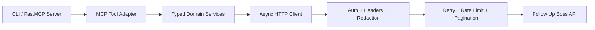

# Architecture

## Design Goals

The repository is structured so that:

- Follow Up Boss API behavior lives in typed Python modules rather than in MCP tool handlers
- transport concerns are centralized and testable in isolation
- MCP tools stay narrow, predictable, and JSON-serializable
- webhook verification and eventual-consistency handling are reusable outside MCP

## Module Layout

### Core configuration and transport

- `src/followupboss_mcp/config.py`: environment-backed settings, auth validation, log-level normalization
- `src/followupboss_mcp/constants.py`: protocol and package constants
- `src/followupboss_mcp/auth.py`: Basic and Bearer auth strategies
- `src/followupboss_mcp/logging.py`: logger configuration plus sensitive-header redaction
- `src/followupboss_mcp/retry.py`: truncated exponential backoff with jitter
- `src/followupboss_mcp/rate_limits.py`: `Retry-After` parsing
- `src/followupboss_mcp/pagination.py`: normalized pagination metadata and async pagination helpers
- `src/followupboss_mcp/http_client.py`: centralized async HTTP transport and error mapping

### Domain models and services

- `src/followupboss_mcp/models/common.py`: shared query, request, response, and JSON value types
- `src/followupboss_mcp/models/*.py`: domain-specific request and response models
- `src/followupboss_mcp/services/*.py`: typed service methods for each supported Follow Up Boss domain

### MCP and webhook layer

- `src/followupboss_mcp/webhooks.py`: signature verification, parsed webhook notification helpers, fast-ack helpers
- `src/followupboss_mcp/mcp_tools.py`: MCP-safe adapter over typed services
- `src/followupboss_mcp/mcp_registration.py`: grouped FastMCP registration helpers for tools, the resource, and the prompt
- `src/followupboss_mcp/mcp_server.py`: FastMCP construction, lifespan wiring, and service-bundle assembly
- `src/followupboss_mcp/cli.py`: stdio and streamable HTTP entrypoint

## Layering

## Request Lifecycle

1. A caller invokes a FastMCP tool or uses the typed service layer directly.
2. MCP input is validated into a request model or primitive tool input.
3. The MCP adapter delegates to a domain service.
4. The service serializes typed request data into query parameters or JSON.
5. `FollowUpBossAsyncClient` injects auth, optional `X-System` headers, timeouts, and logging redaction.
6. The client performs the request with retry and rate-limit logic.
7. JSON responses are validated into typed response models.
8. MCP returns a JSON-serializable response payload with normalized pagination metadata where applicable.

## Retry Strategy

The transport layer implements the retry rules centrally:

- `429` responses respect `Retry-After` when present.
- Retryable `5xx` statuses use truncated exponential backoff with jitter.
- transport-level `httpx` failures share the same retry policy.
- retries stop after `FOLLOWUPBOSS_MAX_RETRIES`.
- retry state is never embedded in MCP tool handlers.

This keeps Follow Up Boss behavior consistent whether the caller is MCP, a script, or direct Python code.

## Pagination Strategy

Follow Up Boss documents both `next` token pagination and `offset` plus `limit`. The repository models both:

- `parse_pagination_metadata()` normalizes `_metadata` into a single `PaginationMetadata` structure.
- `AsyncPaginator` prefers `next` when it exists.
- when `next` is absent but `total` still indicates more data, pagination falls back to `offset`.
- raw metadata is preserved for MCP callers instead of flattening it away.

## Why The Client Is Layered This Way

The split between transport, services, and MCP is deliberate:

- the transport layer owns auth, headers, timeouts, retries, JSON parsing, and HTTP error mapping
- the service layer owns domain semantics such as canonical `POST /events` ingestion, custom field validation, and person-availability polling
- the MCP layer owns tool naming, JSON-safe shaping, and safe error messages

That separation means the same typed SDK can be reused in scripts, background jobs, webhook receivers, or MCP servers without duplicating behavior.

## Event Ingestion Design

`POST /events` is treated as the canonical lead and lead-activity ingestion path because that is how the Follow Up Boss docs position external-system event intake. The repository still supports direct person creation through `POST /people`, but the docs and MCP descriptions call out the distinction clearly.

## Eventual Consistency Handling

Follow Up Boss can expose a short delay between creating a person and allowing subsequent note or call mutations on that record. That behavior is isolated in `PeopleService.wait_for_person()` and used by `NotesService.add_note(..., wait_for_person=True)` so callers can choose safe follow-up behavior without rewriting polling logic.

## Custom Field Strategy

The repository models `/customFields` and validates outgoing keys before writes:

- callers must use the Follow Up Boss field `name`
- labels are intentionally not accepted for outgoing writes
- helper methods let callers resolve labels to names after fetching `/customFields`

## Webhook Design

Webhook verification is kept out of MCP because it is an HTTP receiver concern, not a tool concern:

- signature calculation uses the exact raw request body bytes
- verification uses `FUB-Signature` and `X-System-Key`
- fast acknowledgments are modeled explicitly by `WebhookAck`
- retry expectations are captured by `should_retry_webhook_delivery()`

## MCP Wrapping Strategy

`FollowUpBossToolAdapter` is intentionally thin:

- it converts typed service responses into JSON-serializable dictionaries
- it preserves pagination metadata as `_metadata`
- it turns domain exceptions into safe runtime errors for MCP clients

`mcp_server.py` builds the server and `mcp_registration.py` registers:

- a namespaced tool surface for Follow Up Boss operations
- `followupboss://api-coverage-matrix` as a resource
- `followupboss_compose_lead_event` as a prompt for canonical `POST /events` payload composition
